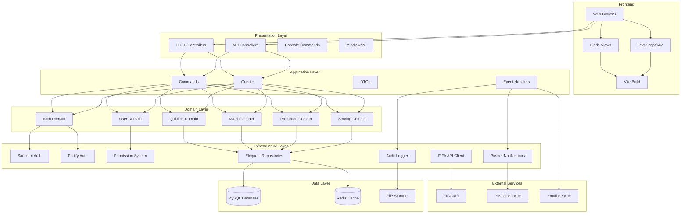
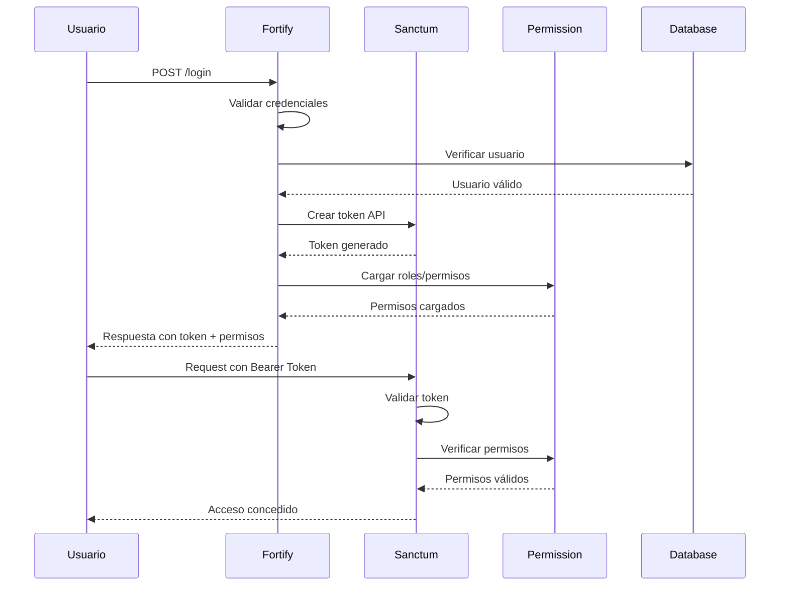
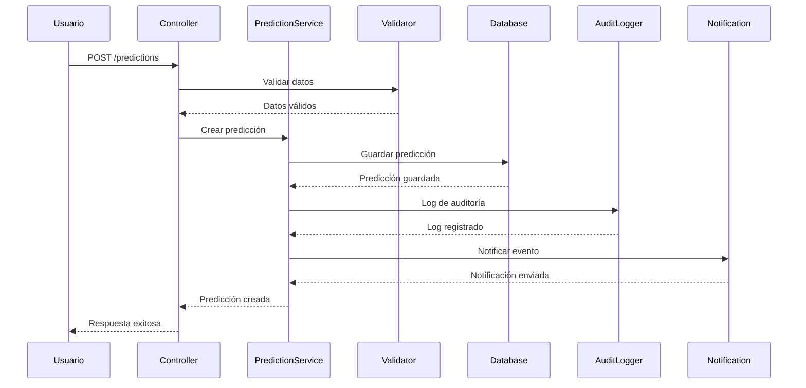
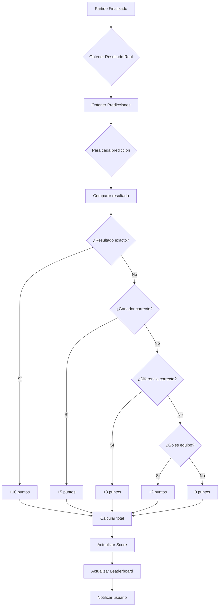
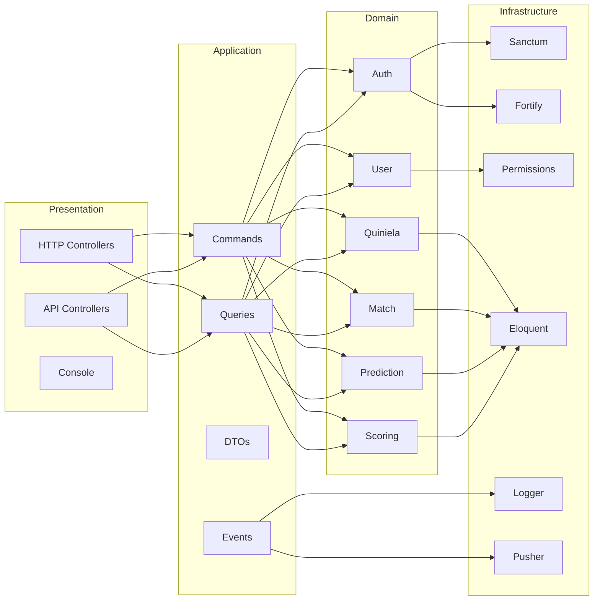
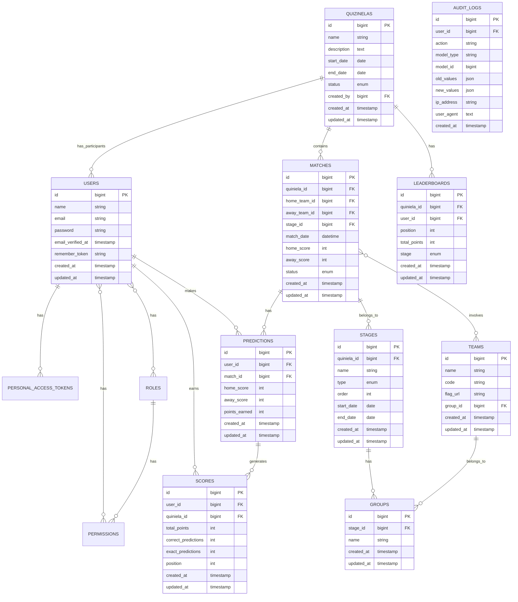
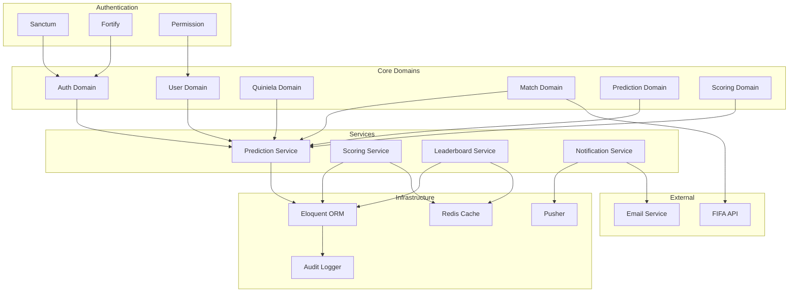

# Arquitectura del Sistema de Quiniela FIFA 2026

## Diagrama de Arquitectura General

## Diagrama de Flujo de Autenticación

## Diagrama de Flujo de Predicciones

## Diagrama de Cálculo de Puntuación

## Diagrama de Estructura DDD

## Diagrama de Base de Datos

## Diagrama de Componentes del Sistema

## Referencias de Arquitectura

### Principios DDD Aplicados
1. **Separación de Responsabilidades**: Cada capa tiene una función específica
2. **Domain Logic en el Dominio**: La lógica de negocio reside en la capa de dominio
3. **Infrastructure Independence**: El dominio no depende de la infraestructura
4. **Application Services**: Orquestan casos de uso sin lógica de negocio
5. **Value Objects**: Representan conceptos inmutables del dominio

### Patrones Utilizados
- **Repository Pattern**: Abstracción de acceso a datos
- **Command Query Responsibility Segregation (CQRS)**: Separación de lectura y escritura
- **Event Sourcing**: Registro de eventos para auditoría
- **Domain Events**: Comunicación entre bounded contexts
- **DTOs**: Transferencia de datos entre capas

### Convenciones de Código
- **PSR-12**: Estilo de código PHP
- **Laravel Pint**: Formateo automático
- **Type Hints**: Tipado estricto en PHP
- **PHPDoc**: Documentación de código
- **SOLID Principles**: Principios de diseño orientado a objetos
