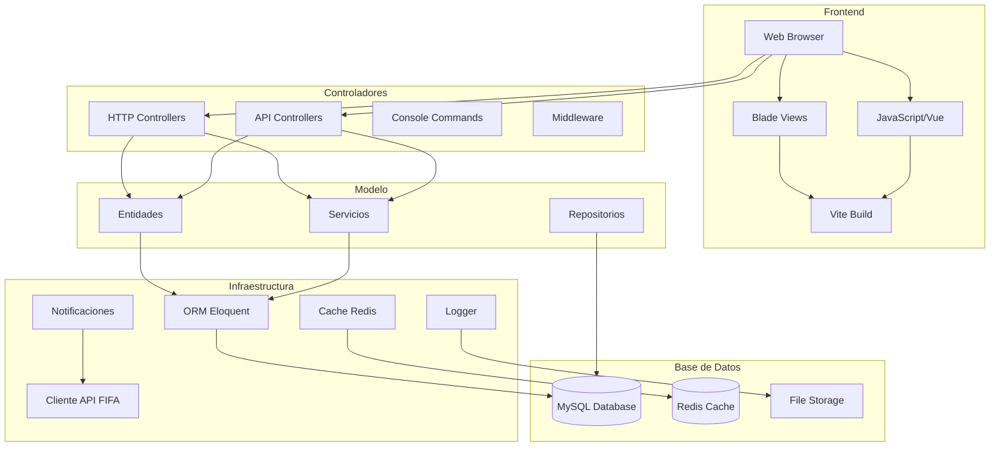

# Arquitectura del Sistema de Quiniela FIFA 2026

## Diagrama de Arquitectura General

## Principios de Arquitectura

1. **Modelo-Vista-Controlador (MVC)**: Organización del código en tres capas principales.
2. **Separación de Responsabilidades**: Cada componente tiene una función específica.
3. **Independencia de Infraestructura**: El modelo no depende directamente de la infraestructura.
4. **Servicios de Aplicación**: Orquestan casos de uso sin lógica de negocio.

## Patrones Utilizados
- **Repository Pattern**: Abstracción de acceso a datos.
- **DTOs**: Transferencia de datos entre capas.

## Convenciones de Código
- **PSR-12**: Estilo de código PHP.
- **Laravel Pint**: Formateo automático.
- **Type Hints**: Tipado estricto en PHP.
- **PHPDoc**: Documentación de código.
- **SOLID Principles**: Principios de diseño orientado a objetos.
